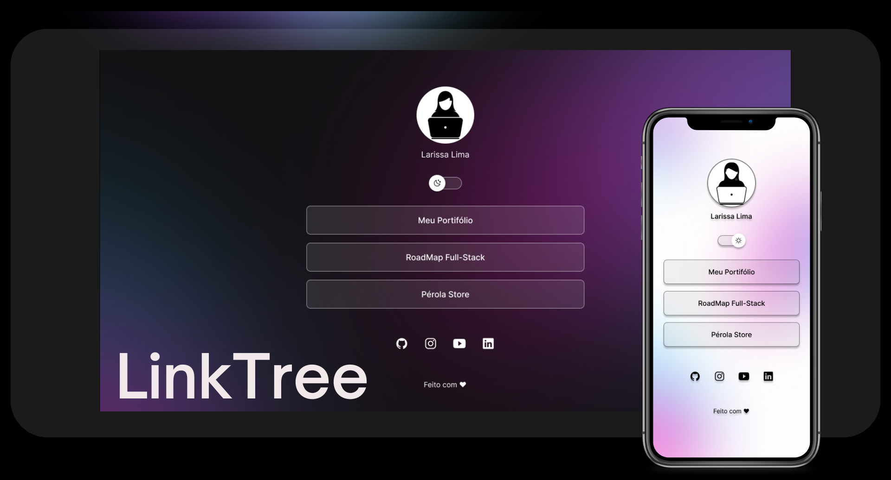

Seja bem vindo(a) ✨

<h1 align="center">LinkTree</h1>

  <a href="#-sobre">Sobre</a>&nbsp;&nbsp;&nbsp;|&nbsp;&nbsp;&nbsp;
  <a href="#-tecnologias">Tecnologias</a>&nbsp;&nbsp;&nbsp;|&nbsp;&nbsp;&nbsp;
  <a href="#-layout">Layout</a>&nbsp;&nbsp;&nbsp;|&nbsp;&nbsp;&nbsp;
  <a href="#-considerações">Considerações</a>&nbsp;&nbsp;&nbsp;|&nbsp;&nbsp;&nbsp;
  <a href="#-licença">Licença</a>

  

<h3>📌 Sobre</h3> 

O projeto Link Tree é um agregador de links do desenvolvedor, que serve como cartão de visitas online. É responsivo e possui a funcionalidade de trocar de tema!

<h3>📌 Tecnologias</h3> 

- HTML, CSS, JavaScript;
- Git;
- Figma;

<h3>📌 Layout</h3>

Você pode visualizar o layout do projeto através [DESSE LINK](https://www.figma.com/community/file/1187422022288947321).
É necessário ter conta no [Figma](https://figma.com) para acessá-lo. 

<h3>📌 Considerações</h3> 

 O projeto foi um ótimo consolidador de conhecimentos adquiridos, uma forma simples e eficaz de testar minhas habilidades, além de ter me desafiado ao construir o componente switch. Utilizei ferramentas do navegador para inspecionar as proporções do design.

<h3>📌 Licença</h3>

Esse projeto está sob a licença MIT.